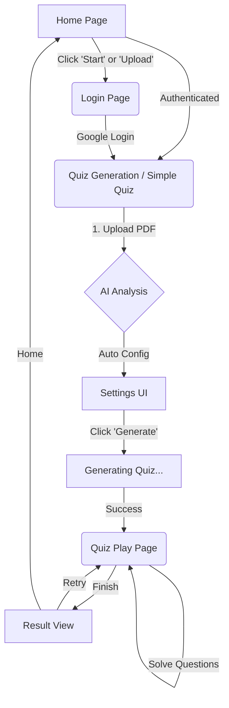

# 📁 Project Structure & Page Flow Documentation

## 1. Project Overview: **A-Pl (에이쁠)**
**A-Pl** is an AI-powered service designed to help university students prepare for exams. By uploading lecture PDFs (text-based or image-based), the AI analyzes the content, extracts key concepts, and automatically generates quizzes (multiple choice & short answer) tailored to the document type (Lecture Notes, Textbooks, Exams). It features a point-based credit system and supports OCR for mathematical formulas.

---

## 2. Page Structure (`app/**/page.tsx`)

### 🏠 **Main Home** (`app/page.tsx`)
- **Purpose**: The landing page and entry point for users.
- **Key Features**:
  - **Responsive Layout**: 
    - **PC**: 2-column grid. Left side features a hero section and quick upload zone. Right side displays the "Service Flow" and tips.
    - **Mobile**: Single column stack with a bottom navigation bar.
  - **Navigation**: Sticky top bar with Logo, User Credits (PC), and Profile/Logout.
  - **Upload Entry**: Large, prominent button to navigate to the **Quiz Generation** page (`/simple-quiz`).
  - **Service Introduction**: Explains the 3-step process (Upload -> Analyze -> Generate).

### 🔑 **Login** (`app/login/page.tsx`)
- **Purpose**: User authentication page.
- **Key Features**:
  - **Social Login**: Google OAuth integration via Supabase.
  - **Guest Access**: Option to continue as a guest (with limited features, usually redirects to login for core functions).
  - **UI**: Simple, centered card layout with branding.

### ⚡ **Simple Quiz (Quiz Generation)** (`app/simple-quiz/page.tsx`)
- **Purpose**: The core functional page for creating quizzes.
- **Flow**:
  1.  **Upload**: User uploads a PDF file.
  2.  **Analysis**: The app (via `/api/quiz/process`) analyzes the document to determine its type (`recommendedDocType`) and suitability.
  3.  **Settings**:
      - **Auto Mode**: AI recommends settings. User sees "AI Optimization Complete".
      - **Manual Mode**: User can override Document Type (Lecture/Textbook/Exam), Analysis Precision (Text/Image), Quiz Mode (Mixed/Term/Concept/Calc), and Question Count.
  4.  **Generation**: Calls `/api/simple-generate` to create the quiz.
  5.  **Redirect**: On success, redirects to the **Quiz Play** page (`/quiz/[quizId]`).

### 📝 **Quiz Play** (`app/quiz/[quizId]/page.tsx`)
- **Purpose**: The interactive interface for solving the generated quiz.
- **Key Features**:
  - **Progress Tracking**: Real-time saving of answers (`/api/quiz/save-progress`). Supports resuming later.
  - **Interaction**: Multiple-choice UI. Immediate feedback (Correct/Incorrect) after selection.
  - **Explanation**: Shows detailed explanations for answers.
  - **Result View**: Displays final score, correct/incorrect count, and options to "Retry" or "Go Home".
  - **State Management**: Handles Loading, Quiz, Result, and Error states.

### 📤 **Upload Debug** (`app/upload/page.tsx`)
- **Purpose**: A developer/testing page for verifying PDF text extraction.
- **Key Features**:
  - Simple PDF uploader.
  - Displays raw extracted text and chunk data for inspection.
  - Useful for debugging `pdfjs-dist` or text parsing logic.

### 👁️ **OCR Debug** (`app/ocr/page.tsx`)
- **Purpose**: A developer/testing page for verifying AI OCR capabilities.
- **Key Features**:
  - specialized uploader for image-based PDFs.
  - Uses Gemini Vision API to extract text and LaTeX formulas from images.
  - Displays processing time, token usage, and confidence scores.

### 🚫 **Auth Error** (`app/auth/auth-code-error/page.tsx`)
- **Purpose**: Error landing page for failed authentication attempts.
- **Key Features**:
  - Simple error message and a link back to the login page.

---

## 3. User Flow Diagram

---

## 4. Key Components & Features

*   **`useAuth` Hook (`src/hooks/use-auth.tsx`)**:
    *   Manages user session, credits (points), and authentication state.
    *   Includes a 30-second timeout for credit fetching to prevent infinite loading loops.
*   **`AuthProvider` (`src/hooks/use-auth.tsx`)**:
    *   Wraps the application to provide global access to auth state.
*   **`PDFUploader`**:
    *   Handles client-side file selection and validation.
*   **Back-end APIs**:
    *   `/api/quiz/process`: Analyzes PDF content, determines document type (`LECTURE`, `TEXTBOOK`, `EXAM`), and chunk suitability.
    *   `/api/simple-generate`: Orchestrates the quiz generation using Gemini AI. Handles prompt engineering, JSON parsing, and DB insertion.
    *   `/api/quiz/save-progress`: Saves the user's answers and score in real-time to Supabase (`QuizAttempt` table).

---

## 5. API Routes Overview

| Route | Method | Description |
| :--- | :--- | :--- |
| `/api/quiz/process` | POST | Analyzes uploaded PDF, recommends document type, and calculates suitability scores. |
| `/api/simple-generate` | POST | Generates quiz questions using Gemini based on the analyzed content and settings. Deducts credits. |
| `/api/quiz/save-progress` | POST | Upserts quiz attempt data (answers, score, status) to the database. |
| `/api/auth/callback` | GET | Handles the OAuth callback from Supabase. |
| `/api/pdf-extract` | POST | (Legacy/Utility) Extracts raw text from PDF for testing. |
| `/api/pdf-ocr` | POST | (Legacy/Utility) Performs OCR on PDF images for testing. |
